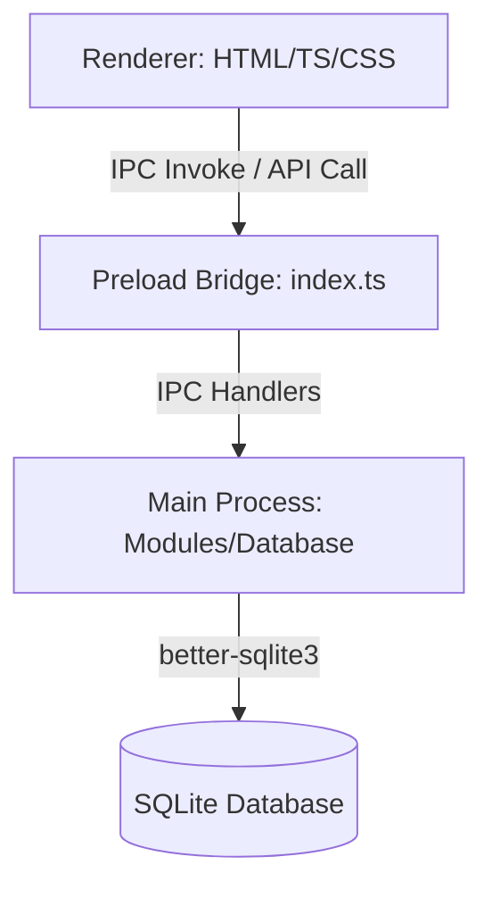

# Developer Agent Guidelines (`agent.md`)

Welcome! This file acts as the project guide and developer profile. When editing or adding features, you must adhere strictly to the rules, tech stack constraints, and database patterns described below.

---

## 1. Tech Stack Overview

*   **Application Model:** Desktop App (Electron)
*   **Main Process (Backend):** Node.js + Electron main process, `better-sqlite3` database driver.
*   **Preload Bridge:** Context bridge to safely expose backend APIs to the frontend.
*   **Renderer Process (Frontend):** Vanilla TypeScript, standard HTML5, and vanilla CSS. **No frontend framework (like React or Vue) is used.**
*   **Build System:** `electron-vite` (Vite for bundling both backend and frontend).

---

## 2. Architecture and Security Boundaries

This project follows a strict three-layer architecture. You must never violate these layers:

### 1. Renderer Layer (`frontend/`)
*   **Rule:** NO direct filesystem access, NO Node.js imports, NO database imports.
*   **Rule:** Interaction with the system is strictly limited to invoking functions exposed on `window.inventoryApi`.

### 2. Preload Layer (`backend/src/preload/index.ts`)
*   **Rule:** Only acts as a bridge. Exposes API methods using `contextBridge.exposeInMainWorld`.
*   **Rule:** Keep logic here minimal. Map renderer calls to `ipcRenderer.invoke`.

### 3. Main Layer (`backend/src/main/`)
*   **Rule:** Handles IPC events, runs business logic, and executes database queries using `better-sqlite3`.
*   **Rule:** All contracts and interfaces passed between frontend and backend are declared in [contracts.ts](file:///c:/Users/CESAR/Documents/trabajo_sis/sis_lubricantes/backend/src/shared/ipc/contracts.ts).

---

## 3. Database Guidelines (SQLite)

*   **Schema Location:** [schema.sql](file:///c:/Users/CESAR/Documents/trabajo_sis/sis_lubricantes/backend/src/shared/database/schema.sql) is the canonical SQLite definition.
*   **Primary Keys:** All tables use **manually-assigned integer primary keys** (e.g. `id_producto`, `id_marca`, `id_venta`). Do NOT use UUID or auto-increment column types unless a schema migration is approved.
*   **Transaction Safety:** Always wrap insertions and sequence increments in a database transaction (`database.transaction()`).
*   **ID Generation:** Use the safety query helper `getNextId` to calculate the next sequence integer.
*   **SQL Injection:** Always use parameterized query bindings (`?` or named parameters) to prevent SQL injection.

---

## 4. Folder Structure Reference

*   `backend/src/main`: Main process configuration, IPC listeners, and db module files.
    *   `db/database.ts`: Database connection initialization, schema execution, and seeding.
    *   `modules/store.ts`: SQL query executions and data mutation logic.
*   `backend/src/preload`: Preload script (`index.ts`) exposing APIs.
*   `backend/src/shared`: Data types and contracts shared between main and renderer.
*   `frontend`: Web interface source files (Vite web project).
*   `docs`: Project requirements, user stories, and specifications.
*   `skills`: Executable developer check lists and walkthroughs.

---

## 5. Coding Standards

*   **TypeScript:** Write strictly-typed code. Avoid using `any` types. Run typechecking before committing.
*   **Styling:** Write premium, modern styles using Vanilla CSS (`frontend/src/style.css`). Use HSL color scales, subtle hover animations, glassmorphism UI elements, and a clean hierarchy.
*   **Modularity:** Split IPC handler handlers into dedicated module files if `store.ts` grows too large.

---

## 6. Verification and Diagnostics

Before completing any task, execute:
*   `npm run typecheck` to verify TypeScript compile status.
*   `npm run build` to ensure the compilation and bundling processes succeed.
